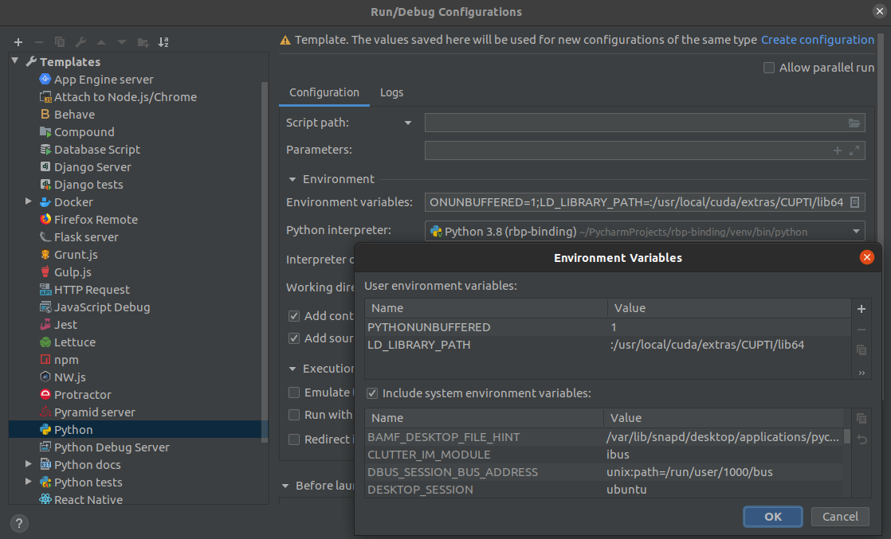

# RazerBladeStealth-eGPU-TensorFlow

## Install Ubuntu 20.04
1. Download and install [Ubuntu 20.04](https://ubuntu.com/download/desktop/thank-you?version=20.04&architecture=amd64)
2. Open Additional Drivers and select nvidia-driver-440
3. Disable nouveau drivers:

        sudo bash -c "echo blacklist nouveau > /etc/modprobe.d/blacklist-nvidia-nouveau.conf"
        sudo bash -c "echo options nouveau modeset=0 >> /etc/modprobe.d/blacklist-nvidia-nouveau.conf"

4. Reboot and test via terminal with `nvidia-smi`
5. Confirm nouveau is disabled: `cat /etc/modprobe.d/blacklist-nvidia-nouveau.conf` should print:

        blacklist nouveau
        options nouveau modeset=0
        
6. Fix suspend loop (i.e. resuming after a lid-closing-induced suspend, will continually suspend 30 seconds after login)
    1. `sudo nano /etc/default/grub`
    2. Find line with `GRUB_CMDLINE_LINUX_DEFAULT="quiet splash`
    3. Modify to `GRUB_CMDLINE_LINUX_DEFAULT="quiet splash button.lid_init_state=open`
    4. Save and close.
    5. `sudo update-grub`
    6. `sudo reboot`
    7. Test if it worked.

## Install Temperature Monitoring
I have blown up two Razer Blades training models on the dGPU. Let's try to avoid that this time around!
1. `sudo apt install lm-sensors`
2. `sudo apt install psensor`
3. Launch `psensor`, set to run on start-up, configure which temp(s) to display on top-panel GUI.
4. Also use https://amanusk.github.io/s-tui/.

## Install Razer-Drivers and CLI
Install this if want you access to gaming mode that can deliver a max of 25W to CPU instead of 15W. This linux tool provides a CLI that mimics Razer Synapse for Windows. Big props to @rnd-ash for adding my 2020 RBS variant to the supported laptops!

1. Install driver:

        cd ~
        git clone https://github.com/rnd-ash/razer-laptop-control/
        cd ~/razer-laptop-control/driver
        cd driver
        sudo make driver_dkms
        Observe version number a.b.c (tested with 1.2.2)
        sudo dkms add -m razercontrol -v a.b.c
        sudo dkms build -m razercontrol -v a.b.c
        sudo dkms install -m razercontrol -v a.b.c
        sudo update-initramfs -u
        sudo reboot
        
2. Install CLI:

        sudo apt install cargo
        cd ~/razer-laptop-control/razer_control_gui
        ./install.sh
        
3. For 15W limit: `razer-cli write power 0`. For 25W limit `razer-cli write power 1`

## Install CUDA + cuDNN and verify both
1. Despite having installed 20.04, TensorFlow's 18.04 [instructions](https://www.tensorflow.org/install/gpu) work.
2. To compile and run samples, one needs gcc-8 and g++-8 (Ubuntu 20.04 ships with version 9):

        sudo apt install gcc-8 g++-8
        sudo update-alternatives --install /usr/bin/gcc gcc /usr/bin/gcc-8 8
        sudo update-alternatives --install /usr/bin/g++ g++ /usr/bin/g++-8 8
        sudo update-alternatives --install /usr/bin/gcc gcc /usr/bin/gcc-9 9
        sudo update-alternatives --install /usr/bin/g++ g++ /usr/bin/g++-9 9
        sudo update-alternatives --config gcc (set to 8)
        sudo update-alternatives --config g++ (set to 8)
        
3. Update environment variables, by adding the following to `~/.bashrc`:

        # export CUDA related paths
        export PATH=/usr/local/cuda-10.1/bin:/usr/local/cuda-10.1/NsightCompute-2019.1${PATH:+:${PATH}}
        export LD_LIBRARY_PATH=/usr/local/cuda-10.1/lib64${LD_LIBRARY_PATH:+:${LD_LIBRARY_PATH}}
        export LD_LIBRARY_PATH=$LD_LIBRARY_PATH:/usr/local/cuda/extras/CUPTI/lib64
        
4. Run `source ~/.bashrc` to take effect (might need to log in and out).

5. Verify CUDA by compiling and running samples:

        cuda-install-samples-10.1.sh ~
        cd ~/NVIDIA_CUDA-10.1_Samples/
        make

6. Verify cuDNN by [compiling and running samples](https://docs.nvidia.com/deeplearning/sdk/cudnn-install/index.html#installlinux-rpm):

## Install Development Environment with CUDA Profiling Capabilities
1. `sudo apt install git`
2. `sudo apt install python3-distutils`
3. `sudo apt install python3-tk`
4. Give permission for profiling: open/create `/etc/modprobe.d/nvidia-kernel-common.conf` and add `options nvidia "NVreg_RestrictProfilingToAdminUsers=0"`.
5. Use software store to get appropriate version of PyCharm.
6. Add lipcupti to LD_LIBRARY_PATH to environment variables within PyCharm's Python run configuration.

7. Clone a TensorFlow project, make a virtual environment with PyCharm, test it out!

## Configure eGPU
Only use use eGPU if the eGPU has a monitor attached. Otherwise, the eGPU will be disabled on boot. 

1. Boot laptop unplugged from Razer Core.
2. Power on Razer Core and connect to Thunderbolt 3 port.
3. Install and follow instructions from [egpu-switcher](https://github.com/hertg/egpu-switcher)

## Install Docker with NVIDIA Support
1. Install Docker per [Ubuntu Instructions](https://docs.docker.com/engine/install/ubuntu/)
2. Complete linux post-implementation [steps](https://docs.docker.com/engine/install/linux-postinstall/)
3. Install [NVIDIA Docker support](https://github.com/NVIDIA/nvidia-docker)
